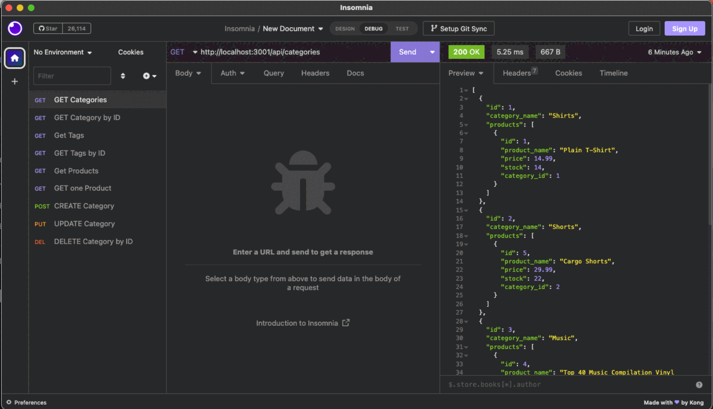

# E-Commerce-ORM

> Module 13

## Description

This app is the back end for an e-commerce site. It's configured by a working Express.js API that uses Sequelize to interact with a MySQL database.

- Make sure to `npm i MySQL2` and `Sequelize` packages to connect your Express.js API to a MySQL database.

- You'll also need the `dotenv` package to use environment variables to store sensitive data.

- Use the schema.sql file in the db folder to create your database with MySQL shell commands.

- Use environment variables to store sensitive data like your MySQL username, password, and database name.

## Table of Contents:

- [Installation](#installation)
- [Usage](#usage)
- [User Story](#user-story)
- [Credits](#credits)
- [License](#license)

## Installation

The following animation shows the application's GET routes to return all categories, all products, and all tags being tested in Insomnia. It also shows, the application's GET routes to return a single category, a single product, and a single tag. Then it demonstrates, the POST, PUT, and DELETE routes for categories.

## Usage

[Walkthrough Video](https://drive.google.com/file/d/1N_97Pil1gK9wtCpuGe4__M6jvVDpWfrU/view?usp=share_link)

## User Story

- AS A manager at an internet retail company
- I WANT a back end for my e-commerce website that uses the latest technologies
- SO THAT my company can compete with other e-commerce companies

## Credits

- [Kong Insomnia](https://insomnia.rest/)
- [My SQL Worbench](https://www.mysql.com/products/workbench/)
- [UCLA Extension Bootcamp](https://www.uclaextension.edu/?gclid=Cj0KCQiAgribBhDkARIsAASA5btdbwAz8x25r3b1deoRNIGxfkPFL11rAQMuCgQ7HYiqBH8CLr9CgLoaAktlEALw_wcB&gclsrc=aw.ds)

## License

Please refer to the LICENSE in the repo.

---
